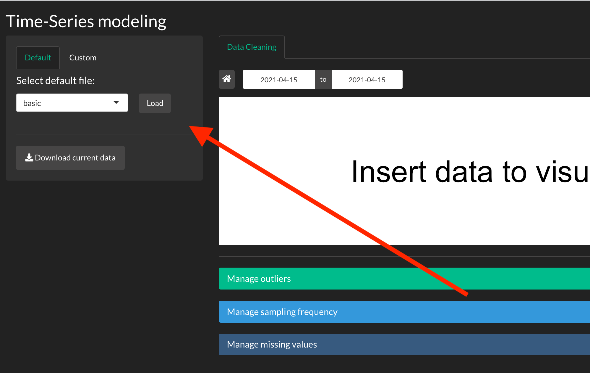
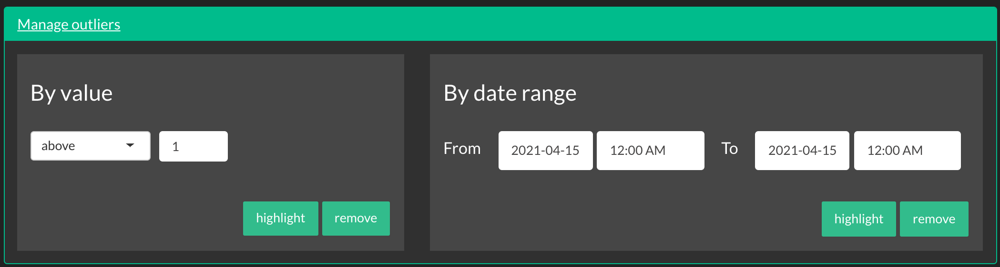
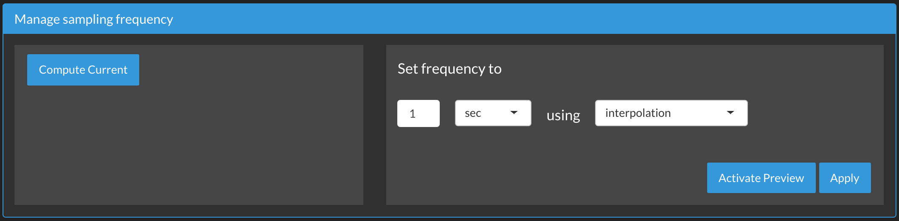
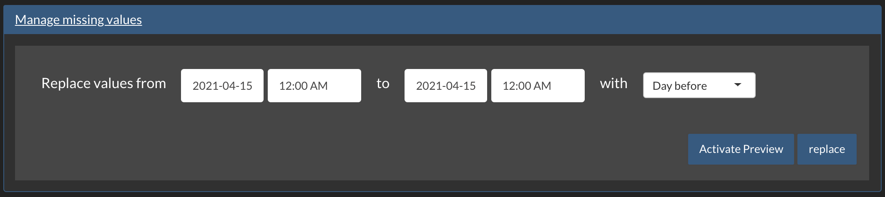
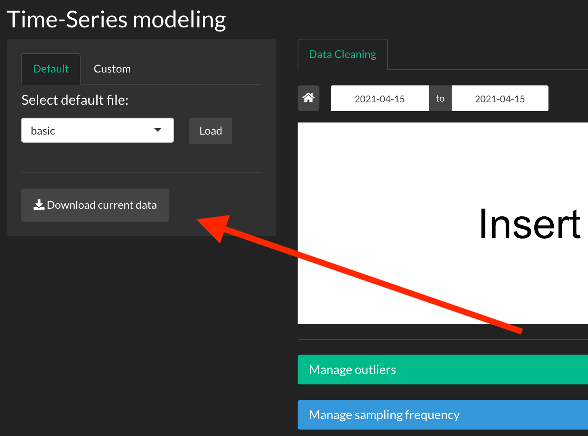

# Tutorial

Here we present a brief tutorial of the app.

## Loading data

From the sidebar panel you can select and upload your dataset. 

There are three different default options:

* **basic**: small dataset with one outlier and a non-constant sampling frequency.
* **medium**: small dataset with outliers, missing values and a non-constant sampling frequency.
* **advanced**: big dataset with outliers, missing values and a non-constant sampling frequency.

You can also upload a **custom** dataset (max: 10MB) that must have the following format

`date,value`\
`%Y-%m-%d %H:%M:%S,float` \

Here is an example 

`date,value`\
`2021-01-01 00:00:00,100.1` \
`2021-01-02 00:00:01,100.2` \

## Managing outliers

From the first collapsible panel you can work with outliers.

You can select outliers based on two rules:

* **By value**: selects all data above/below a threshold
* **By date range**: selects all data in the specified date range

You can both highlight and remove your selection with the provided buttons.

## Managing sampling frequency

From the second collapsible panel you can work with sampling frequency.

As we know, to work with time series model our data must be equispaced in time. This is not always the condition for real-world datasets.
This panel allows you to compute the current sampling frequency of your dataset and edit it using different methods. 

You can also see a preview of the new dataset before appling the transformation using the **Activate Preview** button.

## Managing missing values

From the third collapsible panel you can work with missing values.

A lot of time our datasets presents missing values; a common way to approach the problem is to fill the void using data from different points in time.

This panel allows you to fill the gaps using past or future observations.

You can also see a preview of the new dataset before appling the transformation using the **Activate Preview** button.

## Downloading data

At any point in your analysis you can download the current dataset from the sidebar button.

